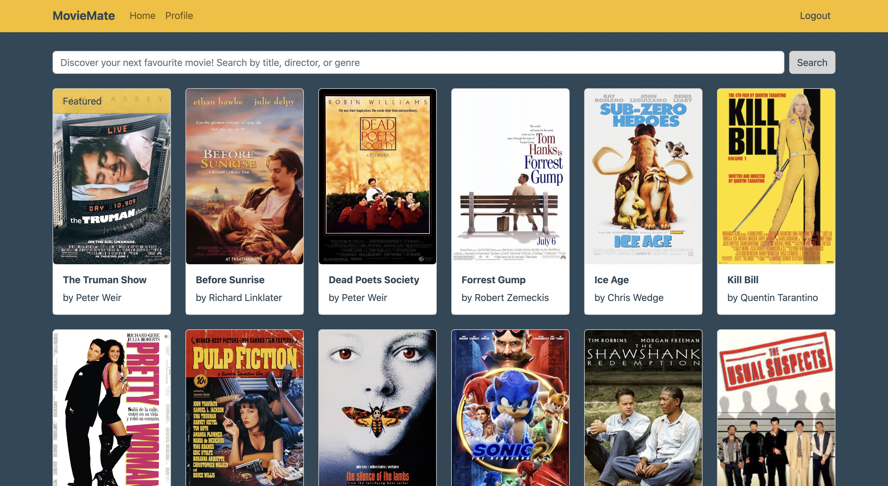

# MovieMate App (Client Side)

## Table of Contents

- [Overview](#overview)
- [Links](#links)
- [Features](#features)
- [Process](#process)
  - [Main Technologies and Dependencies](#main-technologies-and-dependencies)
  - [Linting and Formatting](#linting-and-formatting)
  - [API Documentation](#api-documentation)
- [Getting Started](#getting-started)
  - [How to Run](#how-to-run)
  - [Using the App](#using-the-app)
- [Credits](#credits)

## Overview

MovieMate is a movie app that allows users to access information about different movies. Users can register, update their personal information, and manage a list of their favourite movies.

The client side user interface complements the REST API and MongoDB database which have been [set up previously](https://github.com/ElenaUJ/MyFlix-movie-app), providing a seamless experience for users. Built with the MERN-stack (MongoDB, Express, React, Node.js), MovieMate is a full-stack we application which offers a user-friendly, responsive and efficient solution for those seeking movie information and management.

## Links

- [Live site URL](https://my-moviemate.netlify.app)
- [Code URL](https://github.com/ElenaUJ/MovieMate-client)
- [API URL](localhost:8080/)

## Features

- User Authentication: The app allows users to create a new account, login, view and update their profile information, logout, and delete their account.

- Movie Database: The app grants access to a comprehensive movie database that contains information on a collection of movies.

- Detailed Movie Information: MovieMate provides a detailed overview of each selected movie, including an image, description, director, genre, and a list of similar movies.

- Search Functionality: Users can easily search for movies in the database using the search feature.

- Personalized Top Movies List: MovieMate provides users with the ability to create a personalized top movies list by adding their favourite movies. Users can easily add or remove movies from their top movies list using various methods, such as a toggle button to like or dislike movies.

- Loading Spinners: The app implements loading spinners to indicate the progress of fetch calls and improve user experience.

## Process

### Main Technologies and Dependencies

**Technologies:** React, React Bootstrap

**Dependencies:** For a complete list of dependencies, please refer to the [package.json](./package.json) file.

### Linting and Formatting

- ESLint Rules: [View rules](https://github.com/mydea/simple-pokedex-app/blob/master/.eslintrc)
- Prettier configuration: [View configuration](https://stackoverflow.com/questions/55430906/prettier-single-quote-for-javascript-and-json-double-quote-for-html-sass-and-c)

### API Documentation

Information about the [API used in this project](https://github.com/ElenaUJ/MyFlix-movie-app) (e.g. endpoints, dependencies, error responses, data security information) can be found [here](localhost:8080/documentation.html).

## Getting Started

### How to Run

**Prerequisites**

Ensure you have the following prerequisites installed and configured on your system:

- Node.js
- npm

**Installation**

1. _Clone the Repository:_
   Open your terminal and enter the following command to clone the repository:

   `git clone https://github.com/ElenaUJ/MovieMate-client.git`

2. _Navigate to the Project Directory:_
   Change your working directory to the project folder by entering this command:

   `cd movieMate-client`

3. _Install Dependencies:_
   Run the following command to install the required dependencies:

   `npm install`

4. _Run the Development Server:_
   Start the development server and open the app in your default web browser:

   `npm run start`

   The app will be available at http://localhost:1234.

### Using the App

To access the app, register or use following test credentials: Username: Test; Password: test.

## Credits

- [`@anatoliygatt/heart-switch`](https://github.com/anatoliygatt/heart-switch?ref=madewithreactjs.com): A React component for creating a heart-shaped toggle button.
